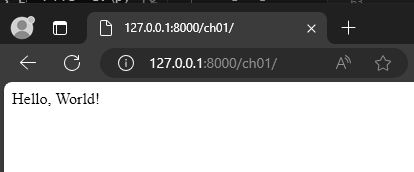

# Setup project
```
$ python -m venv pyvm-django-challenges
$ cd pyvm-django-challenges
$ Scripts\activate
(pyvm-django-challenges) $ pip install django
(pyvm-django-challenges) $ mkdir django-challenges
(pyvm-django-challenges) $ django-admin startproject ch01_hello_world
(pyvm-django-challenges) $ cd ch01_hello_world
```

# Create app
```
(pyvm-django-challenges) $ django-admin startapp simple_view
```

# add app
```
# django-challenges\ch01_hello_world\ch01_hello_world\settings.py
INSTALLED_APPS = [
    #...

    # ch01_hello_world
    'simple_view',
]

```

# add urls
- add urls to project
```
# django-challenges\ch01_hello_world\ch01_hello_world\urls.py
# ...
from django.urls import include

urlpatterns = [
    # ...

    path('ch01/', include('simple_view.urls'))
]

```
- create `urls.py` file in `simple_view` app and add urls:
```
# django-challenges\ch01_hello_world\simple_view\urls.py
from django.urls import path

urlpatterns = [
]
```
## HttpResponse from view
- add view def to `views.py`:
```
# django-challenges\ch01_hello_world\simple_view\views.py
from django.http import HttpResponse

def index(request):
    return HttpResponse('Hello, World!')

```

- add url to `urls.py`
```
# django-challenges\ch01_hello_world\simple_view\urls.py
from django.urls import path
from .views import index

urlpatterns = [
    path("", index, name="hello_view"),
]
```
- run server
```
C:\pyvm-django-challenges\django-challenges\ch01_hello_world>manage.py runserver
Watching for file changes with StatReloader
Performing system checks...

System check identified no issues (0 silenced).

You have 18 unapplied migration(s). Your project may not work properly until you apply the migrations for app(s): admin, auth, contenttypes, sessions.
Run 'python manage.py migrate' to apply them.
April 01, 2024 - 07:55:34
Django version 5.0.3, using settings 'ch01_hello_world.settings'
Starting development server at http://127.0.0.1:8000/
Quit the server with CTRL-BREAK.
```
- navigate to [http://127.0.0.1:8000/ch01/](http://127.0.0.1:8000/ch01/):



## render from template
- create `templates` folder and add html page `hello.html`:
```
<!- templates/hello.html ->
<h1>Hello World</h1>
```

- add view def to `views.py`:
```
# ...
from django.views.generic import TemplateView

# ...
# django-challenges\ch01_hello_world\simple_view\views.py
class HelloPageView(TemplateView):
    template_name = 'hello.html'
```
- add url to page in `urls.py`:
```
# django-challenges\ch01_hello_world\simple_view\urls.py
#...
from .views import index, HelloPageView

urlpatterns = [
    # ...

    # from template
    path('from_template/<str:user_name>', HelloPageView.as_view(), name='hello_template'),
]
```
- run server
```
C:\pyvm-django-challenges\django-challenges\ch01_hello_world>manage.py runserver
Watching for file changes with StatReloader
Performing system checks...

System check identified no issues (0 silenced).

You have 18 unapplied migration(s). Your project may not work properly until you apply the migrations for app(s): admin, auth, contenttypes, sessions.
Run 'python manage.py migrate' to apply them.
April 01, 2024 - 07:55:34
Django version 5.0.3, using settings 'ch01_hello_world.settings'
Starting development server at http://127.0.0.1:8000/
Quit the server with CTRL-BREAK.
```
- navigate to [http://127.0.0.1:8000/ch01/from_template](http://127.0.0.1:8000/ch01/from_template):

](static/0002.png)

## add user name as parameter
- create `templates` folder and add html page `hello_user.html`:
```
<!- templates/hello_user.html ->
<h1>Hello {{ user_name }}</h1>
```

- add view def to `views.py`:
```
# ...
from django.views.generic import TemplateView

# ...
# django-challenges\ch01_hello_world\simple_view\views.py
class HelloUserPageView(TemplateView):
    template_name = 'hello_user.html'
```
- add url to page in `urls.py`:
```
# django-challenges\ch01_hello_world\simple_view\urls.py
#...
from .views import index, HelloPageView, HelloUserPageView

urlpatterns = [
    # ...

    # from template
    path('from_template/<str:user_name>', HelloUserPageView.as_view(), name='hello_template'),
]
```
- run server
```
C:\pyvm-django-challenges\django-challenges\ch01_hello_world>manage.py runserver
Watching for file changes with StatReloader
Performing system checks...

System check identified no issues (0 silenced).

You have 18 unapplied migration(s). Your project may not work properly until you apply the migrations for app(s): admin, auth, contenttypes, sessions.
Run 'python manage.py migrate' to apply them.
April 01, 2024 - 07:55:34
Django version 5.0.3, using settings 'ch01_hello_world.settings'
Starting development server at http://127.0.0.1:8000/
Quit the server with CTRL-BREAK.
```
- navigate to [http://127.0.0.1:8000/ch01/from_template/Ahlal](http://127.0.0.1:8000/ch01/from_template/Ahlal):

](static/0003.png)

# mission complete.